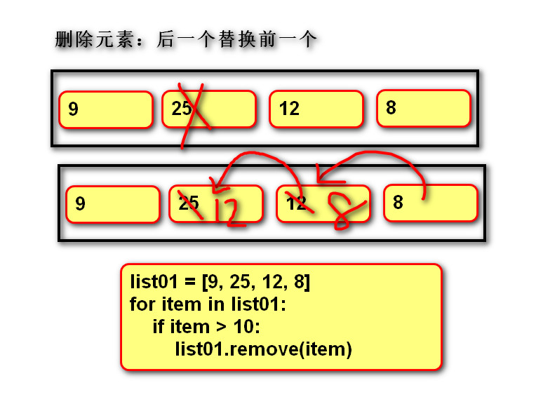
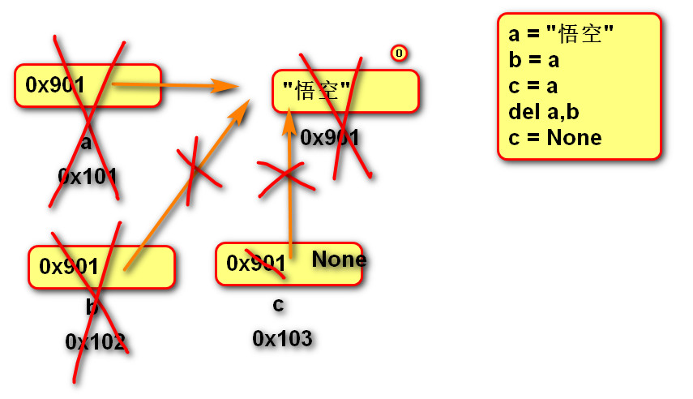
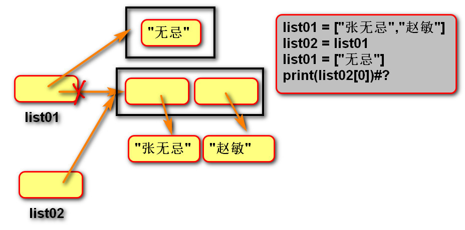
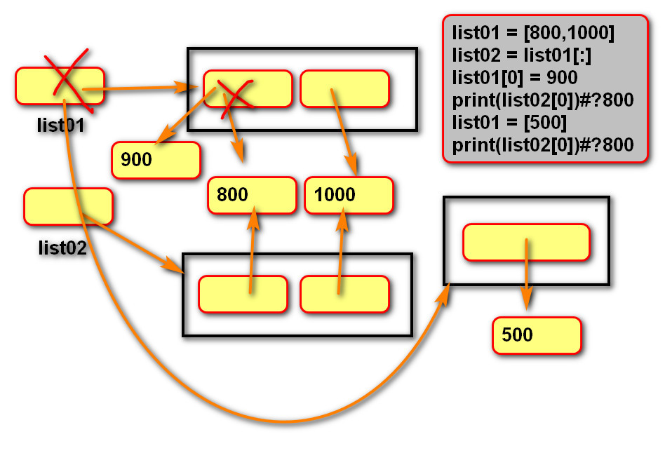
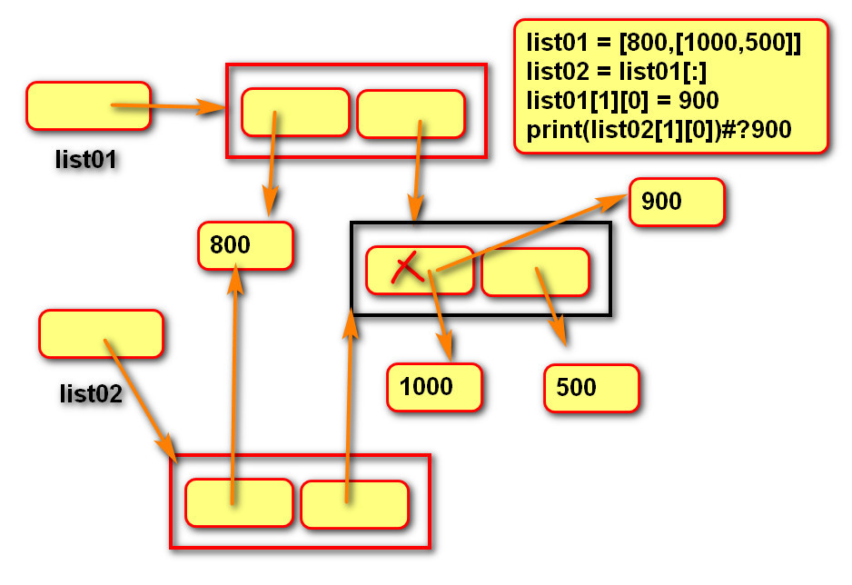
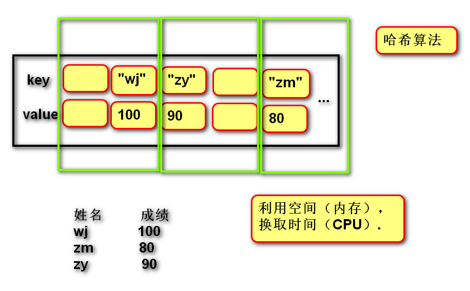
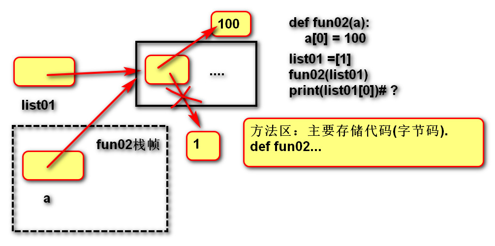
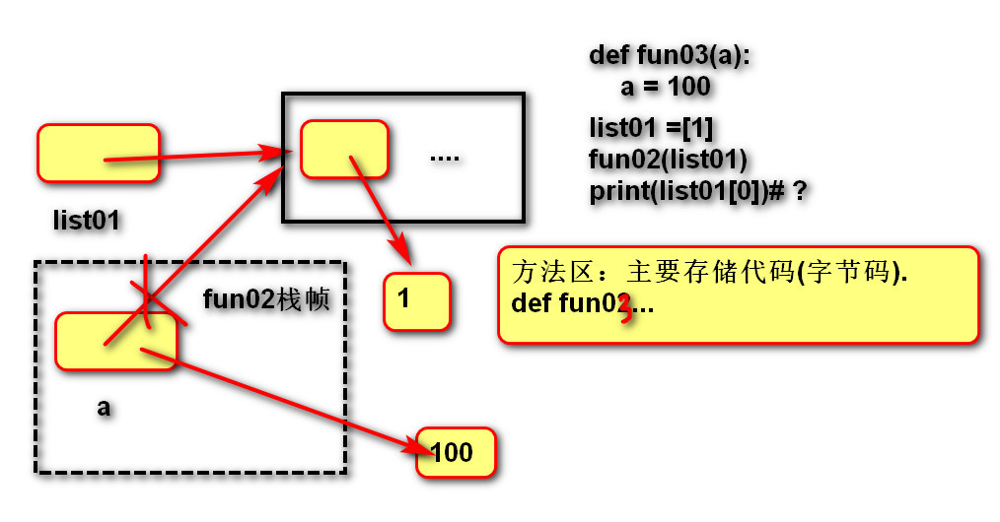
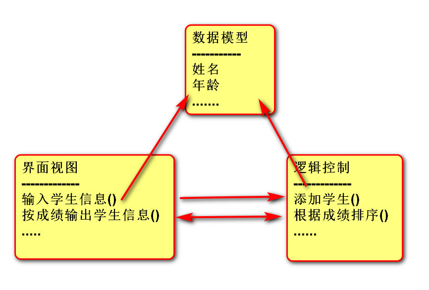
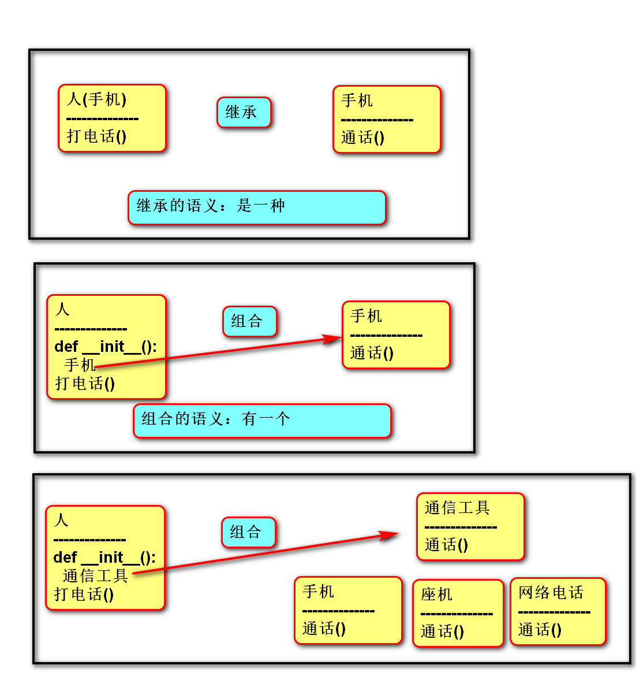

PYTHON

目录

[TOC]

## 一.介绍

- python的特征：

    python是免费，开源，跨平台，动态，面向对象的编程语言

- 执行方式：

    交互式
    文件式

- 执行过程

    源代码-编译 -> 字节码-解释 -> 机器码


### 学习方法:

```sql
1. 知识点必须理解(定义／作用／适用性／语法)
2. 整理笔记(三合一)
3. 当天练习必须独立完成
```

## 二.数据类型:
```python
None
int   例:1 ，2
float 例:1.0 ，2.5
str   例:"" ，"字符"
bool  例:True ，False
复数 　例:complex 
```

### 类型转换
```python
int(数据)
float(数据)
str(数据) 
bool(数据) 

如果数据的格式不正确，会错误。
    例如：int("100+")，int("1.23")
如果数据表示"没有",转换结果为false
    bool(1) --> True
    bool("") -->False
    bool(0)  -->False
```

### 数据赋值内存图


## 三.数据基本运算
### 变量
```python
定义:关联一个对象的标识符
变量名　＝　？　
变量没有类型
```

### 运算符
```python
算数运算符：＋　－　＊　　／　／／(商)　％　**(n次方)
增强运算符:＋=　－=　＊=　　／=　／／=　％=　**=
    a = 10
    a = a + 5
    a += 5
比较运算符:>  <  >=  <=  ==  !=
逻辑运算符: 
1 > 2   
"a" == "b"
False or False
与　and : 一假俱假
或　or :一真俱真
```

## 四.语句
### 1.循环语句 while
    while 条件:
        满足条件一直执行
    else:
        不满足条件执行一次

### 2.循环语句： for
    for 变量 in 可迭代对象:
        循环体

#### 整数迭代器
    range(0,6) 可以迭代出0到6的整数，含头不含尾

#### 随机函数 random
```
import random
random.randInt(1,100) # 随机产生1到100之间的整数，包含1和100
```

### 3.跳转语句
    break    可以跳出当前循环
    continue 可以跳出本次循环进入下次循环

### 4.选择语句  

```python
if bool类型的条件:
    满足条件执行的语句
else:
    不满足条件执行的语句
```

```python
if 条件1:
    满足条件1执行的语句
if 条件2:
    满足条件2执行的语句
if 条件3:
    满足条件3执行的语句
```

```python
if 条件1:
    满足条件1执行的语句
elif 条件2:
    不满足条件１，满足条件2执行的语句
elif 条件3:
    不满足条件１/2,满足条件3执行的语句
else:
    以上条件都不满足执行的语句
```

## 五.字符串
### 1.字节，字符集
```python
ord() 将字符转换秤编码  # 字－－> 数
chr() 将编码转换秤字符  # 数－－> 字
```


### 2.转义符 \
    print(r"\n123")

### 3.格式化输出
    print(“我叫%s,年龄是%d,成绩是%.2f” %(name,age,score))
    list01 = [1,2,3,4,5]
    print("".join("%d"%item for item in list01))

## 六.列表
### 1.切片
    item[1起始位置:2结束位置:3步长]
    item[1:5:2] 从下标为1的位置取到下标为5的位置，不含5的位置，步长为2
    item[:] 从开始位置取到结束位置，步长默认为1
    item[::-1]  从最后一位往前取，步长为1
    item[-2:-5:-1] 从倒数第2位开始到倒数第5位结束,从后外前取值
    item[-2:-5] 从倒数第2位开始到倒数第5位结束,最后一位没有填默认为1,从前往后取,所以取不到值
**切片会产生新的数据,新的数据类型与原类型相同**


### 2.链接 join 
```
# join 将列表连接成字符串
str1 = "".join(list1)
```
### 3.拆分 split
```
# split 将一定格式的字符串拆分成列表
str1 = "张无忌,赵敏,小昭"
list1 = str1.split(",")  #以","拆分字符串
```

### 4.列表方法
    append  往列表最后增加元素
    pop     默认删除最后一个元素
    remove  移除列表种的制定元素，移除后，该元素后面的元素都会向前移动一个位置，使用删除最好从结尾开始


    del     删除列表种指定位置的元素


### 5.内建函数
    len() 
    max() 
    min() 
    sum()

### 6.列表推导式
```
list01 = [1,2,3]
list02 = []
for item in list01():
    list02.append(item)

# 等同于：
list02 = [item for item in list01]
```
### 7.求列表中的最小值


### 8.列表推导式嵌套：
```
lista = ["a","b","c"]
listb = ["d","e"]
listc = []
for itema in lista:
    for itemb in listb:
	listc.append(itema+itemb) 
print(listd)

listd = [itema+itemb for itema in lista for itemb in listb]
print(listd)
```

## 七.复制
### 1.浅复制
    浅复制：只复制一层
```
list1 = list2[:]
```
```
list1 = list2.copy()
```
```
for i in range(0,len(list2)):
    list1[i] = list2[i]
```

    浅复制内存图1:

    浅复制内存图2:

    浅复制内存图3:


### 2.深复制
    深复制：复制所有层
```
import copy
list1 = copy.deepcopy(list2)
```
    深复制内存图:


### 浅拷贝和深拷贝的区别:

```python
1.浅拷贝: 创建新对象，其内容是原对象的引用,它仅仅只拷贝了一层
    浅拷贝有三种形式：切片操作，工厂函数，copy模块中的copy函数。
    如： lst = [1,2,3,[4,5]] 
    切片操作：lst1 = lst[:] 或者 lst1 = [each for each in lst]
    工厂函数：lst1 = list(lst)
    copy函数：lst1 = copy.copy(lst)

2.深拷贝：深拷贝拷贝了对象的所有元素，包括多层嵌套的元素,深拷贝出来的对象是一个全新的对象，不再与原来的对象有任何关联
深拷贝只有一种形式，copy模块中的deepcopy函数。
```


## 八.元组
### 1.创建
```
tuple01 = ()
tuple01 = (1,2,3)
tuple01 = tuple([1,2])
tuple01 = (1,)
```

### 2.获取元素（索引  切片）
```
tuple03 = ("a", "b", "c", "d")
e01 = tuple03[1]
print(type(e01))
```

```
# 可以直接将元组赋值给多个变量
tuper04 = (100, 200)
a, b = tuper04
print(a)
print(b)
```

### 3.遍历
```
tuple01 = (1,2,3)
for item in tuple01():
    print(item)
```

### 4.与 in 结合判断是否存在
```
if i in (1,2,3,4):
    print("OK")
```
### 5.列表与元组的区别


## 九.字典
### 1.创建 空字典
```
dict01 = {}
dict01 = dict()
# 创建有默认值的字典
dict01 = {"wj":100,"zm":80,"zr":90}
dict01 = dict([("a","b"),("c","d")])
print(dict01) # {'a': 'b', 'c': 'd'}
```
    字典内存图


### 2.查找元素
```
# 根据key查找value
print(dict01["a"])
# 如果ｋｅｙ不存在，查找时会错误.
if "qtx" in dict01:# 如果存在key
    print(dict01["qtx"])
```

### 3.修改元素
    之前存在key的时候从可以修改
    dict01["a"] = "BB"

### 4.添加
    之前不存在key就可以添加,如果之前存在就变成修改了
    dict01["e"] = "f"

### 5.删除
```
del dict01["a"]
print(dict01)
```

### 6.遍历
>遍历:获取字典中所有元素
```python
# 遍历字典，获取key
for key in dict01:
    print(key)
    print(dict01[key])
    
# 遍历字典，获取key
for key in dict01.keys():
    print(key)
    
# 遍历字典，获取value
for value in dict01.values():
    print(value)

# 遍历字典，获取键值对key value(元组).
for item in dict01.items():
    print(item[0])
    print(item[1])

# 遍历字典，获取键值对key value(值).
for k,v in dict01.items():
    print(k)
    print(v)
```
### 7.字典推导式：
```python
dict02 = {}
dict01 = {"a":10,"b":8,"c":5}
for k,v in dict01.items():
    dict02[k] = v**2
print(dict02)

dict03 = {k:v**2 for k,v in dict01.items()}
print(dict03)
```

## 十.集合 set
### 1.定义 
    由一系列不重复的不可变类型变量组成的可变映射容器
### 2.创建
```
set01 = {"a",} 
set02 = set()
set03 = set(listc)
set03 = set(可迭代对象)
```
### 3.集合与列表的转换
```
set01 = set(listc)
lictd = list(set)
```
### 4.固定集合 frozenset 
    固定集合是由别的类型转换而来
```
frozenset01 = frozenset(["a","b","a"])
print(frozenset01)  #frozenset({'a', 'b'})
frozenset01 = frozenset("ababa")
print(frozenset01)  #frozenset({'a', 'b'})
frozenset01 = frozenset({"a":10,"b":8})
print(frozenset01)  #frozenset({'a', 'b'})
```

### 5.基础操作
    (1). 创建空集合： 
    集合名 = set()  
    集合名 = set(可迭代对象)
    (2). 创建具有默认值集合：
    集合名 = {1, 2, 3}
    集合名 = set(可迭代对象)
    (3). 添加元素：
    集合名.add(元素)
    (4). 删除元素：
    集合名.discard(元素)

### 6.运算 & | - ^ < > == !=
(1).交集&：返回共同元素。
>s1 = {1, 2, 3}
s2 = {2, 3, 4}
s3 = s1 & s2  # {2, 3}

(2).并集：返回不重复元素
>s1 = {1, 2, 3}
s2 = {2, 3, 4}
s3 = s1 | s2  # {1, 2, 3, 4}

(3).补集-：返回只属于其中之一的元素
>s1 = {1, 2, 3}
s2 = {2, 3, 4}
s1 - s2  # {1} 属于s1但不属于s2

(4).补集^：返回不同的的元素
>s1 = {1, 2, 3}
s2 = {2, 3, 4}
s3 = s1 ^ s2  # {1, 4}  等同于(s1-s2 | s2-s1)

(5).子集<：判断一个集合的所有元素是否完全在另一个集合中
(6).超集>：判断一个集合是否具有另一个集合的所有元素
>s1 = {1, 2, 3}
s2 = {2, 3}
s2 < s1  # True
s1 > s2  # True

(7).相同或不同== !=：判断集合中的所有元素是否和另一个集合相同。
>s1 = {1, 2, 3}
s2 = {3, 2, 1}
s1 == s2  # True
s1 != s2  # False
子集或相同,超集或相同 <=  >=


## 十一.容器之间的对比
- 字符串:
  
    >不可变 存储编码值 序列
- 列表:
    >可变　存储变量 序列
    预留空间
    扩容：开辟更大的空间
	 拷贝原有数据
	 替换引用
- 元组:
    >不可变　存储变量　序列
    按需分配
- 字典:
  
    >可变 存储键值对 散列
- 集合:
  
    >可变 存储键 散列
- 固定集合:
  
    >不可变 存储键 散列

## 十二.函数:
### 1.定义：
    用于封装一个特定的功能，表示一个功能或者行为

### 2.作用：
    提高代码的可重用性和可维护性

### 3.语法：
```
def 函数名(形式参数):
    函数体

def add(a,b):
    return a+b
```
### 4.返回值 return
    函数体没有return时返回None

**可变／不可变类型在传参时的区别**
- 不可变类型参数有:
    >数值型(整数，浮点数,复数)
    布尔值bool
    None 空值
    字符串str
    元组tuple
    固定集合frozenset

- 可变类型参数有:
    >列表 list
    字典 dict
    集合 set

- 传参说明：(可以画内存图理解)
    >不可变类型的数据传参时，函数内部不会改变原数据的值。
    可变类型的数据传参时，函数内部可以改变原数据。

### 5.作用域 LEGB
    (1)定义：变量起作用的范围
    (2)Local局部作用域：函数内部。
    (3)Enclosing  外部嵌套作用域 ：函数嵌套。 
    (4)Global全局作用域：模块(.py文件)内部。 
    (5)Builtin内置模块作用域：builtins.py文件

- 变量名的查找规则
    >(1). 由内到外：L -> E -> G -> B
    (2). 在访问变量时，先查找本地变量，然后是包裹此函数外部的函数内部的变量，之后是全局变量，最后是内置变量

### 6.函数参数(实际参数)
```
def fun01(a, b, c, d):
    print(a)
    print(b)
    print(c)
    print(d)
```
>(1).位置实参：实参与形参根据位置进行依次对应.
fun01(1, 2, 3, 4)

>(2).关键字实参:实参与形参根据名称进行对应
fun01(b=1, d=2, c=3, a=4)

>(3).序列实参:星号将序列拆分后按位置与形参进行对应如果参数很多，可以存储在序列(字符串/列表/元组)中,再通过*拆分,直接传入函数.
list01 = ["a","b","c","d"]
fun01(*list01)

>(4).字典实参:双星号将字典拆分后按名称与形参进行对应
    如果参数很多，可以存储在字典中,
　　再通过**拆分,传入函数.
dict01 = {"a": 1, "c": 3, "d": 4, "b": 2}
fun01(**dict01)

### 7.函数参数(形式参数)
>(1).缺省(默认)形参:如果实参不提供，可以使用默认值.
```
def fun01(a=None, b=0, c=0, d=0):
    print(a)
    print(b)
    print(c)
    print(d)
# 关键字实参 + 缺省形参:调用者可以随意传递参数.
fun01(b=2, c=3)
```
>(2).位置形参
```
def fun02(a, b, c, d):
    print(a)
    print(b)
    print(c)
    print(d)
```

>(3).星号元组形参: * 将所有实参合并为一个元组
    作用：让实参个数无限
def fun03(*args):
    print(args)

>(4).命名关键字形参:在星号元组形参以后的位置形参
    目的：要求实参必须使用关键字实参.
```
def fun04(a, *args, b):
    print(a)
    print(args)
    print(b)
fun04(1, b=2)
fun04(1, 2, 3, 4, b=2)
```

>(5).双星号字典形参：**目的是将实参合并为字典.
    实参可以传递数量无限的关键字实参.
```
def fun06(**kwargs):
    print(kwargs)
fun06(a=1, b=2)
```

### 8.函数内存图





## 十三.面向对象
```python
概述：
    面向过程：关注过程(细节)   “干”
            例如：购物车
            选择菜单-->购买-->打印商品信息-->创建订单--> ...
                |->结算-->...
    面向对象：关心解决问题的人  “找”

类与对象:
    类：类别

    对象：个体

    类与类区别：行为(函数/方法)不同
    对象与对象区别:数据不同

语法：
    创建类：
    　　class 类名:
            def __init__(self,参数):
                #数据成员
                self.数据1　= 参数

            #行为成员
            def 方法名称():
                方法体

   创建对象：
        变量名　＝　类名(参数)
```

## 十四.类和对象
### 1.类:
    抽象　　　向量 class Vector2    str  int   list
### 2.对象:
    具体　　1,2   Vector2(1,2)   "a"   1    [1,2]
### 3.类和对象的区别：
    类与类行为不同
    对象与对象数据不同
    Vector2(1,2)　Vector2(3,4)
    同一个类型的多个对象,数据不同(1,2/3,4),行为(求方向，求大小)相同.

### 4.类成员：
    实例：对象的数据(变量)，对象的行为(方法).
    类:类的数据(变量),类的行为(方法).
        可以被所有对象共同操作的数据
    静态方法:
        实例方法操作实例变量，表示"个体"行为.
        类方法操作类变量，表示"大家"行为.
        静态方法不能操作数据，表示为函数都可以.

### 5.语法:实例
```
class MyClass:
    def __init__(self, a):
        # 实例变量
        self.a = a

    # 实例方法
    def print_self(self):
        # 可以操作实例变量
        print(self.a)

# 通过对象访问
m01 = MyClass(100)
m01.a = 1

m02 = MyClass(100)
print(m02.a)
```

### 6.语法:类
```
class MyClass02:
    # 类变量
    a = 0

    # 类方法
    @classmethod  # 自动传入当前方法的参数是类，而不是对象.
    def print_self(cls):
        # 可以操作类变量
        print(cls.a)

#通过类名访问
print(MyClass02.a)
MyClass02.print_self()
```
### 7.不常用的访问方式(不建议使用)
    #访问实例方法，还可以通过类。
    MyClass.print_self(m01)  # 也必须传递对象
    
    # 访问类成员，还可以通过对象
    m03 = MyClass02()
    print(m03.a)
    print(m03.print_self())

## 十五.封装
    数据角度：将多个变量封装到一个自定义类中。
        优势：符合人类的思考方式
            可以将数据与对数据的操作封装到一起
    
    功能角度：对外提供必要的功能,隐藏实现的细节.
            DoubleListHelper.get_elements()
            私有化：将名称命名为以双下划线开头.
                    内部修改成员名称
            属性：对实例变量的保护(拦截读/写操作)
                __slots__:限定类创建的对象只能有固定的实例变量.
    
    设计角度：
        分而治之:将大的需求分解为多个类，每个类负责一个职责。
        变则疏之：遇到变化点单独封装为一个类
        ------------------
        高内聚：一个类有且只有一个发生变化的原因
        低耦合：类与类的关系松散

### 代码示例
```
class Student:
    def __init__(self, name, age):
        self.name = name
        self.age = age
        # ....

    def print_self(self):
        print(self.name, self.age)


s01 = Student("无忌哥哥", 28)
# 通过对象调用实例成员
s01.name = "张无忌"
s01.print_self()


class Student02:
    def __init__(self, name, age):
        self.name = name
        # self.age = age
        # self.__age = age
        self.set_age(age)

    def get_age(self):
        return self.__age

    def set_age(self, value):
        self.__age = value


s01 = Student02("无忌哥哥", 28)
s01.name = "张无忌"


class Student03:
    def __init__(self, name, age):
        self.name = name
        self.age = age
        # self.__age = age
        # self.set_age(age)

    def __get_age(self):
        return self.__age

    def __set_age(self, value):
        self.__age = value

    age = property(__get_age, __set_age)


s01 = Student03("无忌哥哥", 28)
s01.name = "张无忌"
print(s01.age)


class Student04:
    def __init__(self, name, age):
        self.name = name
        # 只读
        self.__age = age

    @property
    def age(self):
        return self.__age


class Student05:
    def __init__(self, name, age):
        self.name = name
        # 只写
        self.__age = age

    def __set_age(self, value):
        self.__age = value

    age = property(None, __set_age)


s01 = Student05("zs", 10)
s01.age = 11


# print(s01.age)


class Student06:
    def __init__(self, name, age):
        self.name = name
        # 可读可写
        self.age = age

    @property
    def age(self):
        return self.__age

    @age.setter
    def age(self, value):
        self.__age = value


s01 = Student06("zs", 10)
s01.name = "ls"
s01.age = 11
print(s01.age)


class Student07:
    __slots__ = ("name")

    def __init__(self, name):
        self.name = name


s01 = Student07("wj")


# s01.name = "无忌"
# print(s01.name)

# 添加了新实例变量
# s01.nmae = "无忌"
# print(s01.nmae)

class Student08:
    __slots__ = ("__age")

    def __init__(self, age):
        self.age = age

    @property
    def age(self):
        return self.__age

    @age.setter
    def age(self, value):
        self.__age = value


s01 = Student08(10)
s01.age = 11
print(s01.age)
```

## 十六.三层架构:
    View   Model  Controller
    界面    数据    业务逻辑
    变化    载体     变化

```
class XXController:
    def add_xx(self, a):
        print("Controller 添加了数据", a)


class XXView:
    def __init__(self):
        self.c = XXController()

    def input_xx(self):
        # 需求：调用XXController类中的实例方法add_xx
        self.c.add_xx(100)


v = XXView()
v.input_xx()
```




## 十七.面向对象：
    考虑问题从对象的角度出发.
    抽象：从多个事物中，舍弃个别的/非本质的特征(不重要)，
        抽出共性的本质(重要的)过程。

### 1.三大特征：
    封装：
        数据的角度:将多个变量封装到一个自定义的类中
        功能的角度:对外提供必要的功能,隐藏实现的细节
        设计的角度:
            分而治之:将一个大的需求分解成多个类,每个类只负责一个职责
            变则疏之:遇到变化点就单独封装成一个类
            高类聚:每个类有且只有一个变化的原因
            低耦合:类与类之间的关系松散
    
        将每个变化点单独分解到不同的类中。
            例如：老张开车去东北
            做法：定义人类，定义车类。
    
    继承：重用现有类的功能和概念，并在此基础上进行扩展。
           统一概念
        例如：图形管理器，统计圆形/矩形.....面积。
        做法：用图形类代表/约束，圆形/矩形..具有计算面积的方法.
    
    多态：调用父类的方法，执行子类方法,父类的方法是抽象的,子类的方法是具体的
        重写：覆盖父类那个比较抽象的方法。
        例如：图形管理器调用图形的计算面积方法
             具体图形必须重写图形的计算面积方法。
        继承是共性(计算面积)，多态个性(长*宽 / pi *r**2)。

### 2.设计原则
    开闭原则：允许增加新功能，不允许修改客户端代码.
    单一职责：一个有且只有一个改变的原因.
    依赖倒置：调用抽象(父)，不要调用具体(子);
            抽象不要依赖具体.
    组合复用：如果仅仅是代码的复用，优先使用组合.
    里氏替换:任何父类出现的地方都可以被子类替换掉
    迪米特法则:指类与类之间在需求满足的条件下,尽量不要有太多的关联

### 3.类与类关系
    泛化[继承](做成爸爸)
    关联(做成成员变量)
    依赖(做成方法参数)

### 4.内存图
>图形管理器

>组合复用

>继承内存图


## 十八.模块
### 1.定义：.py文件
### 2.作用：多人合作开发
### 3.导入：
    import 模块
    模块.成员名
    
    import 模块 as 别名
    别名.成员名
    -------------------
    from 模块 import 成员1
    直接使用成员
    -------------------
    from 模块 import *

### 4.模块相关概念
	4-1.通过__all__指定可导出成员
	from module01 import *
	
	MyClass.fun03()
	_fun02()
	
	4-2.可以通过该属性，查看文档注释
	print(__doc__)
	
	4-3.返回当前模块的绝对路径（从系统根目录开始计算的）
	print(__file__)
	
	4-4.现象：
	主模块叫做：__main__
	非主模块叫做：真名
	print(__name__)
	作用1： 不是主模块不执行。(测试代码)
	作用2： 只有是主模块才执行。(主模块代码)
	使用：
```
if __name__ == "__main__":
	pass
```
## 十九.time模块
    import time

- 1.返回时间戳,从1970-01-01开始算起到现在经过的秒数
    >a = time.time()
    print(a)  # 1561027851.4983401

- 2.返回本地时间 (年，月，日，时，分，秒，一周的第几天，一年的第几天，夏令时)
    >#格式：时间元组格式,可以用索引取值
    #time.struct_time(tm_year=2019, tm_mon=6, tm_mday=20, tm_hour=18,
    #tm_min=50, tm_sec=51, tm_wday=3, tm_yday=171, tm_isdst=0)
    time.localtime()
    print(tuple_time[1])  # 获取月

- 3.返回"%Y-%m-%d %H:%M:%S"格式的字符串
    >#时间元组 -->  str
    a = time.strftime("%Y-%m-%d %H:%M:%S",time.localtime())
    print(a)  # 2019-06-20 18:54:03

- 4.str  -->  时间元组
  
>print(time.strptime(str_time01, "%Y / %m / %d %H:%M:%S"))

- 5.让系统沉睡几秒
  
    >time.sleep(5) #系统停顿5秒再执行接下来的程序

## 二十.包 package
    学会如何相互调用，如何引入包，没有Pychar的时候如何引入包
    
    定义：包含__init__.py文件的文件夹
    作用:团队分工,结构清晰.
    导入: import 包.模块  as 变量
        from 包.模块 import 成员
        from 包.模块 import ×
    原理：import sys
        sys.path + from 的路径可以正确的定位到文件，导包才成功.

## 二十一.异常处理
```python
异常类的基类是 Exception
try:
    ....
except:
    ....
finial:
    ....

# 1.获取异常
try:
    age = int(input("请输入年龄:"))
except ValueError:
    print("输入错误")
except Exception:
    print("输入错误")

2.自定义异常
class AtkError(Exception):
    def __init__(self,msg,line,atk,id):
        self.msg = msg
        self.line = line
        self.atk = atk
        self.id = id
```

### 代码
```python
class Enemy:
    def __init__(self,name,atk):
        self.name = name
        self.atk = atk

    @property
    def atk(self):
        return self.__atk

    @atk.setter
    def atk(self,values):
        if 0<=values <=100:
            self.__atk = values
        else:
            raise AtkError("攻击力错误",23,"0到100之间","10010")

try:
    e1 = Enemy("外星人",1000)
except AtkError as e:
    print("%s 错误的行数：%d 错误编号：%s 值的范围：%s"%(e.msg,e.line,e.id,e.atk))
```

## 二十二.生成器

### 生成器/迭代器

```
生成器 = 迭代器 + 可迭代对象
```

### for循环的原理:

```
(1)获取迭代器
(2)循环获取下一个元素
(3)遇到异常停止
```

```python
list_ = ["张三丰","张翠山","张无忌"]
for item in list_:
    print(item)

#for循环的原理
listiter =list_.__iter__() #获取迭代器
while True:
    try:
        item = listiter.__next__() #循环获取下一个元素
        print(item)
    except StopIteration:
        break
```

### 生成器表达式:

```python
变量 = (item for item in 可迭代对象 if条件) 生成器表达式
# 变量 = [itme for item in 可迭代对象 if 条件] 列表推导
# 变量 = {k,v for k,v in 可迭代对象 if 条件} 字典推导
# 变量 = {item for item in 可迭代对象 if条件} 集合推导
```

### 生成器和迭代器的区别:

```python
# 可迭代对象：可以被转化为不依赖索引取值的容器，这样的对象就叫做可迭代对象
#       -- 对象.__iter__() 来生成不依赖索引取值的容器
#       -- 结论：有__iter__()方法的对象都称之为 可迭代对象

# 迭代器对象：可以通过__next__()的方式进行取值的容器，且取一个少一个
#       -- 结论：有__next__()且可以通过__next__()进行取值的容器
#       -- 注意：迭代器对象自身也拥有__iter__(), 通过该方法返回的是迭代器对象自身

# 迭代器(for循环)：就是用来从可迭代对象中进行取值的循环方法 | 语法：for 变量 in 对象:
#       -- 1.通过对象.__iter__()获取其对应的迭代器对象
#           -- for可以操作迭代器对象及可迭代对象，统一写法，所以迭代器和可迭代对象都有__iter__()
#       -- 2.在内部通过迭代器对象的__next__()进行取值，将值赋值给 语法中的变量，取一个少一个
#       -- 3.当迭代器对象取完了，在内部自动捕获异常，并结束循环取值

(1)迭代器是一个更抽象的概念，任何对象，如果它的类有next方法和iter方法返回自己本身。对于string、list、dict、tuple等这类容器对象，使用for循环遍历是很方便的。在后台for语句对容器对象调用iter()函数，iter()是python的内置函数。iter()会返回一个定义了next()方法的迭代器对象，它在容器中逐个访问容器内元素，next()也是python的内置函数。在没有后续元素时，next()会抛出一个StopIteration异常

(2)生成器（Generator）是创建迭代器的简单而强大的工具。它们写起来就像是正规的函数，只是在需要返回数据的时候使用yield语句。每次next()被调用时，生成器会返回它脱离的位置（它记忆语句最后一次执行的位置和所有的数据值）

区别：生成器能做到迭代器能做的所有事,而且因为自动创建了__iter__()和next()方法,生成器显得特别简洁,而且生成器也是高效的，使用生成器表达式取代列表解析可以同时节省内存。除了创建和保存程序状态的自动方法,当发生器终结时,还会自动抛出StopIteration异常
```

## 二十三.函数式编程

```python
# 语法
def fun01():
    print("fun01执行喽")

def fun02():
    print("fun02执行喽")

# 将函数作为函数的参数进行传递
# 将一个函数的代码(fun02/fun01),注入到另外一个函数中(fun03)
def fun03(func):
    print("fun03执行喽")
    func()

fun03(fun01)
fun03(fun02)
```

函数式编程思想

```
函数式编程 思想
练习:exercise05.py
```

```python
class SkillData:
    def __init__(self,id,name,atk_ratio,duration):
        self.id = id
        self.name = name
        self.atk_ratio = atk_ratio
        self.duration = duration

    def __str__(self):
        return "技能数据是:%d,%s,%d,%d"%(self.id,self.name,self.atk_ratio,self.duration)

list_skill = [
    SkillData(101,"乾坤大挪移",5,10),
    SkillData(102,"降龙十八掌",8,5),
    SkillData(103,"葵花宝典",10,2),
]

# 需求1:获取攻击比例大于6的所有技能
def find01():
    for item in list_skill:
        if item.atk_ratio > 6:
            yield item

# 需求2:获取持续时间在4--11之间的所有技能
def find02():
    for item in list_skill:
        if 4<item.duration<11:
            yield item

# 需求3:获取技能名称大于4个字并且持续时间小于6的所有技能
def find04():
    for item in list_skill:
        if len(item.name) > 4 and item.duration < 6:
            yield item

# "封装"(分而治之 变则疏之)
# 将每个变化的条件,单独定义在函数中.
def condition01(item):
    return item.atk_ratio > 6

def condition02(item):
    return 4<item.duration<11

def condition03(item):
    return len(item.name) > 4 and item.duration < 6

# "继承"(隔离变化)
def find(func_condition):
    """
        通用的查找方法
    :param func_condition: 查找条件,函数类型.
            函数名(变量) --> 返回值bool类型
    :return:
    """
    for item in list_skill:
        # "多态":调用父(变量),执行子(具体函数).
        #       不同子类重写父类方法,执行逻辑不同.

        # if item.atk_ratio > 6:
        # if condition01(item):
        if func_condition(item):
            yield item

for item in find(condition01):
    print(item)

for item in find(condition02):
    print(item)
```

