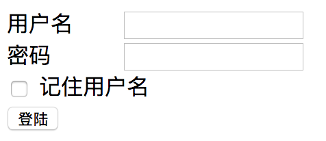
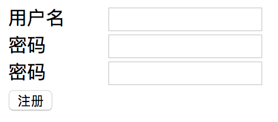

《Django Web框架教学笔记》

 - 讲师: 魏明择
 - 时间: 2019

## 目录
[TOC]


### session 会话控制
- 什么是session
  
- session又名会话控制，是在服务器上开辟一段空间用于保留浏览器和服务器交互时的重要数据
  
- session的起源
    - http协议是无状态的：每次请求都是一次新的请求，不会记得之前通信的状态
    - 实现状态保持的方式：在客户端或服务器端存储与会话有关的数据
    - 推荐使用sesison方式，所有数据存储在服务器端
- 实现方式
    - 使用 session 需要在浏览器客户端启动 cookie，且用在cookie中存储sessionid
    - 每个客户端都可以在服务器端有一个独立的Session
    - 注意：不同的请求者之间不会共享这个数据，与请求者一一对应

- Django启用Session
    - 在 settings.py 文件中
    - 向 INSTALLED_APPS 列表中添加：
        ```python
        INSTALLED_APPS = [
            # 启用 sessions 应用
            'django.contrib.sessions',
        ]
        ```
    - 向 MIDDLEWARE_CLASSES 列表中添加：
        ```python
        MIDDLEWARE = [
            # 启用 Session 中间件
            'django.contrib.sessions.middleware.SessionMiddleware',
        ]
        ```

- session的基本操作:
    - session对于象是一个在似于字典的SessionStore类型的对象, 可以用类拟于字典的方式进行操作
    - session 只能够存储能够序列化的数据,如字典，列表等。

    1. 保存 session 的值到服务器
        - `request.session['KEY'] = VALUE`
    2. 获取session的值
        - `VALUE = request.session['KEY']`
        - `VALUE = request.session.get('KEY', 缺省值)`

    - 删除session的值
        - `del request.session['KEY']`
    - 在 settings.py 中有关 session 的设置
        1. SESSION_COOKIE_AGE
            - 作用: 指定sessionid在cookies中的保存时长(默认是2周)，如下:
            - `SESSION_COOKIE_AGE = 60 * 60 * 24 * 7 * 2`
        2. SESSION_EXPIRE_AT_BROWSER_CLOSE = True
            设置只要浏览器关闭时,session就失效(默认为False)
    - session 缺省配置
        - 模块
            - `import django.conf.global_settings`

- 注: 当使用session时需要迁移数据库,否则会出现错误
    ```sh
    $ python3 manage.py makemigrations
    $ python3 manage.py migrate
    ```


### 用户登陆逻辑处理
- 当用户登陆时，可以在session添加一个键 'user' 绑定一个当前登陆用户的信息，如果在 ` 'user' in request.session` 成立，即当前用户为登陆状态，可以从`request.session['user'] `获限登陆信息。否则为没有登陆状态

- 登陆逻辑处理
    1. 检查用户和密码是否是合法用户
    2. 如果是合法用户，在当前用户的session记录
        ```python
        # 在session内保存当前用的名称和id
          request.session['user'] = {
              'user': 'tedu',
              'id': 1
          }
        # 注： 没有登陆的用户 request.session['user'] 不存在
        ```
- 退出登陆的逻辑处理
    3.  退出登陆时，删除session['user'] 
        ```python
        if 'user' in request.session:
            del request.session['user']
        ```
- 判断用户是否登陆:
    ```python
    if 'user' in request.session:
        ...  当前用户登陆中
    else:
        ... 没有登陆
    ```

- 练习:
    - 实现用户登陆、退出功能
    - 说明:
        
        - 如果用户输入的登陆数据合法，则在session['user']内记录一个已经登陆的用户状态
    - 要求 ：
        1. 创建一个 user 应用 实现用户登陆,注册，退出登陆的逻辑
            - `python3 manage.py startapp user`
        1. 创建一个 index 应用 实现用户主页
            - `python3 manage.py startapp index`
    - 模型类
        1. 用户模型类
            ```python
            class User(models.Model):
                username = models.CharField("用户名", max_length=30, unique=True)
            password = models.CharField("密码", max_length=30)
    
                def __str__(self):
                    return "用户" + self.username
            ```
    - 登陆设计规范(在user应用中写代码)
        | 路由正则 | 视图函数 | 模板位置 | 说明 |
        |-|-|-|-|
        | /user/login | def login_view(request): | templates/user/login.html | 用户登陆 |
    | /user/logout  | def logout_view(request| 无 | 退出用户登陆 |
    
    - 主页设计规范(在index应用中写代码)
        | 路由正则 | 视图函数 | 模板位置 | 说明 |
        |-|-|-|-|
    | / | def index_view(request): | templates/index/index.html | 主页 |
    
    - 界面参考:
        - 登陆界面
            - 
        - 注册界面
            - 
        - 主页
            - 登陆前
                - 
            - 登陆后
                - 
        

